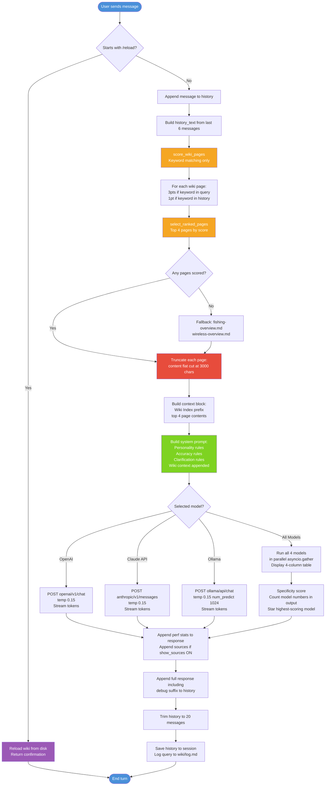
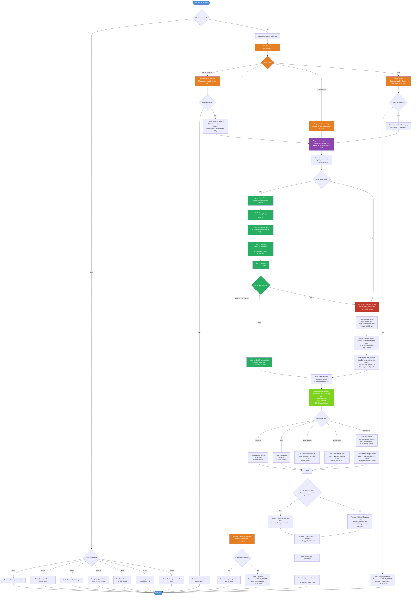

# GSM Outdoors Chatbot — System Flowcharts

---

## Flowchart 1 — Original Version (gsm_support_demo_backup_2026-04-24)

### Key Weaknesses in Original Version

| Component | Problem |
|---|---|
| Retrieval | Keyword-only — "lightest steelhead rod" matches nothing if "steelhead" not in keyword list |
| Page truncation | `content[:3000]` flat cut — Q&As at the bottom of a page are always lost |
| No brand gate | System prompt tells LLM to ask about brand, but no programmatic enforcement |
| No brand scoping | All 20+ pages scored on every query — fishing pages compete with hunting pages |
| No multi-turn memory | If LLM asks "which brand?" and user replies "Phenix", next retrieval runs on "Phenix" not the original question |
| Generic wiki headings | `## Questions — Pricing & Warranty` on every page — near-identical embeddings across all pages |
| MAX_WIKI_TOKENS = 3000 | Frequently cuts off correct answers mid-page |

---

## Flowchart 2 — Current Version (gsm_deploy_pkg)

---

## What Changed — Side-by-Side Summary

| Area | Original | Current |
|---|---|---|
| **Retrieval method** | Keyword matching only | Section-level semantic cosine similarity always active; keyword as fallback only |
| **Embedding model** | None | nomic-embed-text via local Ollama |
| **Vector database** | None | SQLite with 106+ embedded sections |
| **Wiki section headings** | Generic headings on all pages | Series-specific headings — 21 headings renamed across 7 files |
| **Context budget** | 3000 chars flat cut per page | 5000 tokens with intelligent section selection |
| **Brand gate** | None — LLM prompt only | Programmatic state machine: IDLE → AWAIT_BRAND → CONFIRMED |
| **Brand scoping** | All pages compete on every query | Confirmed brand narrows vector search to one brand's sections only |
| **Category filtering** | None | Fishing / hunting / wireless signals zero out off-category pages |
| **Multi-turn query bug** | User replies "Phenix" then retrieval runs on "Phenix" | Walks back history to recover original question after brand reply |
| **Brand re-asking bug** | STATE_CONFIRMED still ran detect_brand every turn | STATE_CONFIRMED branch skips detection entirely |
| **Overview demotion** | Hub pages compete equally with series pages | Hub pages capped at score 1.0 when any series page scores higher |
| **num_predict Ollama** | 1024 tokens max output | 4096 tokens max output |
| **Commands** | /reload only | /reload /reset /pages /search /read /wrong /speed |
| **Sources toggle** | Off by default | On by default; suppressed on clarification turns |
| **Dedicated wiki sections** | None | Iron Feather warranty, Trifecta comparison, M1 Bass specs added |
| **Wiki structure guide** | None | WIKI_STRUCTURE_GUIDE.md with rules for all future pages |
